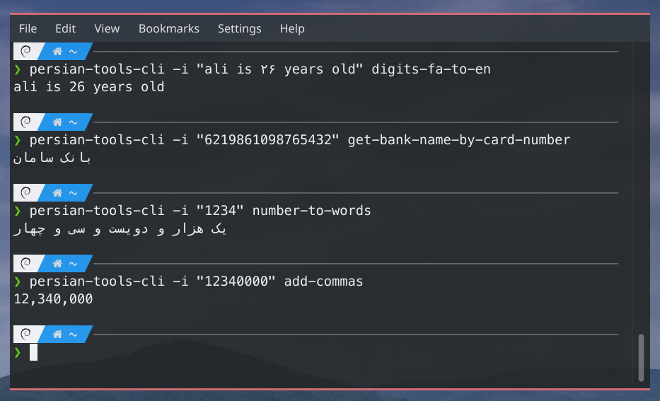
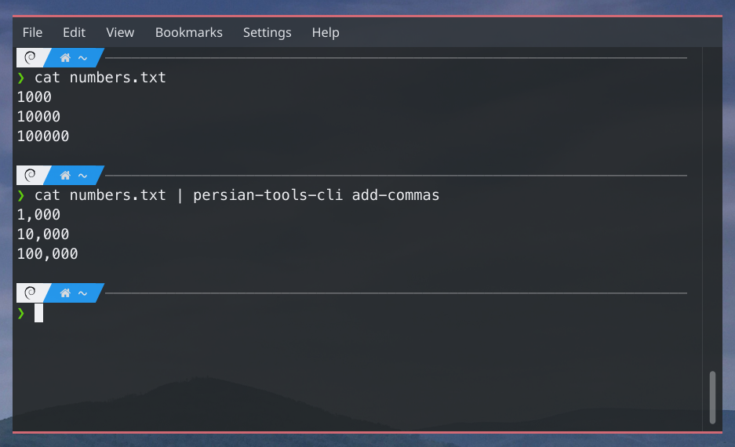

# Persian Tools Cli

Command line interface for [rust-persian-tools](https://github.com/persian-tools/rust-persian-tools) library.


## Example

### With param

You can pass input by -i option:
</img>

### With std-in

</img>

## Help page

```posh
persian-tools-cli
cli for rust-persian-tools crate

Usage: persian-tools-cli [OPTIONS] <COMMAND>

Commands:
  add-commas                        Adds commas to number,
  remove-commas                     Remove commas from number, example: 3,100 -> 3100
  add-ordinal-suffix                Add persian ordinal suffix to numbers, example: "بیست و یک" -< "بیست و یکم"
  remove-ordinal-suffix             Remove persian ordinal suffix from numbers, example: "بیست و یکم" -< "بیست و یک"
  has-arabic                        Return true if the entered string includes arabic characters
  is-arabic                         Return true if the entered string does not include other-language characters
  to-arabic                         Description: Replaces all instances of ی and ک with  ي and ك,
  get-bill-type                     Gets barcode as input and returns bill type types: (Water, Electricity, Gas, Tel, Mobile, Municipality, Tax, DrivingOffense)
  get-bill-amount                   Gets barcode as input and returns bill amount in Rials
  digits-fa-to-en                   "۵۴۱" -> "541"
  digits-en-to-fa                   "541" -> "۵۴۱"
  digits-en-to-ar                   "451" -> "٤٥۱"
  digits-ar-to-en                   "٤٥۱" -> "451"
  digits-fa-to-ar                   "۴۵۱" -> "٤٥۱"
  digits-ar-to-fa                   "٤٥۱" -> "451"
  extract-card-number               Returns list of card numbers extracted from input separated with ','
  find-capital-by-province          "البرز" -< "کرج"
  get-bank-name-by-card-number      6219861000000000 -> "بانک سامان"
  get-city-by-iran-national-id      <national_id> -> "کرج"
  get-province-by-iran-national-id  <national_id> -> "البرز"
  add-half-space                    Takes input and make it standard in case of using half space
  remove-half-space                 Opposite of add-half-space
  verify-iranian-legal-id           اعتبار سنجی شناسه حقوقی Returns true|false
  verify-iranian-national-id        اعتبار سنجی کد ملی Returns true|false
  get-plate-type                    Input is a car or motorcycle number plate Returns (car | motorcycle)
  get-plate-province                Input is a car or motorcycle number plate Returns نام استان
  get-plate-category                Input is a car or motorcycle number plate Returns (دیپلمات - سفارتخانه - تاکسی - ارتش - شخصی و...)
  number-to-words                   "5677" -> "پنج هزار و ششصد و هفتاد و هفت"
  has-persian                       Return true if the entered string includes persian characters
  is-persian                        Return true if the entered string does not include other-language characters
  to-persian-chars                  Description: Replaces all instances of ي and ك with ی and ک,
  is-phone-valid                    Phone number as input and returns (false|true)
  get-operator-prefix               09387891234 -> 938, +989387891234 -> 938, 00989387891234 -> 938
  get-phone-operator                09380000000 -> Irancell
  get-phone-province                09140000000 -> تبریز
  is-sheba-valid                    شماره شبا رو اعتبار سنجی میکنه
  sheba-to-bank-name                شماره شبا رو میگیره و اسم بانک بر میگردونه
  sheba-to-persian-bank-name        شماره شبا رو میگیره و اسم فارسی بانک بر میگردونه
  time-diff                         برای دو لحظه از زمان یک متن فارسی تولید میکنه که اختلاف دو لحظه رو توصیف میکنه
  url-fix                           حروف فارسی رو به فرمتی تبدیل میکنه که در url قابل استفاده باشه
  verify-card-number                شماره کارت بانکی رو اعتبار سنجی میکنه
  words-to-number                   حروف فارسی رو به عدد تبدیل میکنه
  help                              Print this message or the help of the given subcommand(s)

Options:
  -i, --input <INPUT>  if you don't pass --input param it will take std-in as input
  -h, --help           Print help
  -V, --version        Print version
```


## Installation

There is three ways to install persian tools cli

### 1. Download binary

Download binary from [here](https://github.com/ali77gh/PersianToolsCli/releases).
add binary to your PATH

### 2. Install from crates.io

If you have cargo installed you can install this tool simply by running:

```posh
cargo add persian-tools-cli
```

### 3. Build from source

```posh
git clone https://github.com/ali77gh/PersianToolsCli.git
cd PersianToolsCli
cargo build --release

# linux
cp ./target/release/project_analyzer /usr/bin

# MacOS
cp ./target/release/project_analyzer /usr/local/bin/

# Windows
# add binary to Environment Variables Path
```
